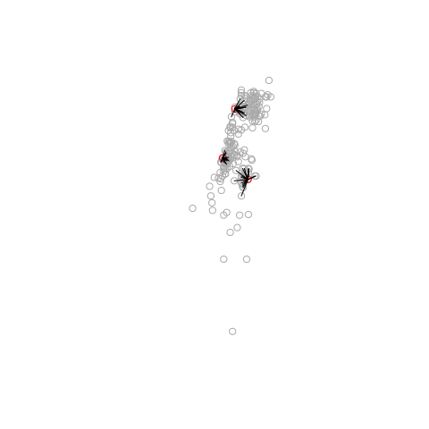

<!-- README.md is generated from README.Rmd. Please edit that file -->
[](https://cran.r-project.org/package=nngeo) [](https://cran.r-project.org/package=nngeo)

nngeo
=====

The goal of `nngeo` is to provide **k-nearest neighbor join** capabilities for spatial analysis in R.

Installation
------------

CRAN version -

``` r
install.packages("nngeo")
```

GitHub version -

``` r
install.packages("devtools")
devtools::install_github("michaeldorman/nngeo")
```

Usage
-----

Once installed, the library can be loaded as follows.

``` r
library(nngeo)
#> Loading required package: sf
#> Linking to GEOS 3.5.1, GDAL 2.2.2, proj.4 4.9.2
```

Example
-------

The following code section finds the 10-nearest towns for each city using function `st_nn`.

``` r
data(towns)
data(cities)
nn = st_nn(cities, towns, k = 20)
#> 
  |                                                                       
  |                                                                 |   0%
  |                                                                       
  |======================                                           |  33%
  |                                                                       
  |===========================================                      |  67%
  |                                                                       
  |=================================================================| 100%
nn
#> [[1]]
#>  [1] 29 40 87  2 49 43  9 11 63 36 37 52 10 44 46 70 48 65 39 35
#> 
#> [[2]]
#>  [1] 18 19 39 32 28 44 25 10 64 46 33 92 81 26 45 50 36 70 71 35
#> 
#> [[3]]
#>  [1] 69 80 61 68 60 58 30 57 89 56 22  7 24 78 13 84  6  3 59 20
```

By default, the result is a sparse list with the neighbor IDs.

The `st_nn` function can also be used as a **geometry predicate function** when performing spatial join with `sf::st_join`.

``` r
nearest_towns = st_join(cities, towns, join = st_nn, k = 3)
#> 
  |                                                                       
  |                                                                 |   0%
  |                                                                       
  |======================                                           |  33%
  |                                                                       
  |===========================================                      |  67%
  |                                                                       
  |=================================================================| 100%
head(nearest_towns)
#> Simple feature collection with 6 features and 2 fields
#> geometry type:  POINT
#> dimension:      XY
#> bbox:           xmin: 34.78177 ymin: 31.76832 xmax: 35.21371 ymax: 32.0853
#> epsg (SRID):    4326
#> proj4string:    +proj=longlat +datum=WGS84 +no_defs
#>        name.x    name.y                  geometry
#> 1   Jerusalem AMMINADAV POINT (35.21371 31.76832)
#> 1.1 Jerusalem     ALMON POINT (35.21371 31.76832)
#> 1.2 Jerusalem ABU GHOSH POINT (35.21371 31.76832)
#> 2    Tel-Aviv      AZOR  POINT (34.78177 32.0853)
#> 2.1  Tel-Aviv    ADANIM  POINT (34.78177 32.0853)
#> 2.2  Tel-Aviv  AHI'EZER  POINT (34.78177 32.0853)
```

A helper function `st_connect` can be used to draw lines according to joined feature IDs. This may be useful for visualization or for network analysis.

``` r
l = st_connect(cities, towns, ids = nn)
plot(st_geometry(towns), col = "darkgrey")
plot(st_geometry(cities), col = "red", add = TRUE)
plot(st_geometry(l), add = TRUE)
```


