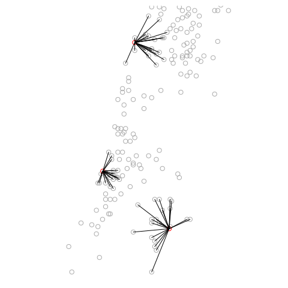

<!-- README.md is generated from README.Rmd. Please edit that file -->

[](https://cran.r-project.org/package=nngeo)
[](https://cran.r-project.org/package=nngeo)

nngeo
=====

The goal of `nngeo` is to provide **k-nearest neighbor join**
capabilities for spatial analysis in R.

Installation
------------

CRAN version:

``` r
install.packages("nngeo")
```

GitHub version:

``` r
install.packages("remotes")
remotes::install_github("michaeldorman/nngeo")
```

Usage
-----

Once installed, the library can be loaded as follows.

``` r
library(nngeo)
#> Loading required package: sf
#> Linking to GEOS 3.8.0, GDAL 3.0.4, PROJ 7.0.0
```

Example
-------

The following code section finds the 20-nearest towns for each city
using function `st_nn`.

``` r
data(towns)
data(cities)
nn = st_nn(cities, towns, k = 20, progress = FALSE)
#> lon-lat points
nn
#> [[1]]
#>  [1]  70  99  60  15  36  56 193 142  90  82  17  93  44  13  32   9 172  34 103
#> [20] 132
#> 
#> [[2]]
#>  [1] 145 175  57 144  29  55  21  64 138  24 121 146  53 126 160  31  62 187  85
#> [20]  83
#> 
#> [[3]]
#>  [1]  59 179 137 114 141 134  67 152  41 133   6 140  23 166  66   2 189  73 173
#> [20] 147
```

By default, the result is a sparse list with the neighbor IDs.

The `st_nn` function can also be used as a **geometry predicate
function** when performing spatial join with `sf::st_join`.

``` r
st_join(cities, towns, join = st_nn, k = 3, progress = FALSE)
#> lon-lat points
#> Simple feature collection with 9 features and 5 fields
#> geometry type:  POINT
#> dimension:      XY
#> bbox:           xmin: 34.78177 ymin: 31.76832 xmax: 35.21371 ymax: 32.79405
#> geographic CRS: WGS 84
#>        name.x            name.y country.etc    pop capital
#> 1   Jerusalem         Jerusalem      Israel 731731       1
#> 1.1 Jerusalem Mevasserat Ziyyon      Israel  22470       0
#> 1.2 Jerusalem          Har Adar      Israel   2101       0
#> 2    Tel-Aviv         Ramat Gan      Israel 128583       0
#> 2.1  Tel-Aviv     Tel Aviv-Yafo      Israel 384276       0
#> 2.2  Tel-Aviv        Giv'atayim      Israel  48882       0
#> 3       Haifa             Haifa      Israel 266418       0
#> 3.1     Haifa      Tirat Karmel      Israel  19080       0
#> 3.2     Haifa    Qiryat Motzkin      Israel  39413       0
#>                      geometry
#> 1   POINT (35.21371 31.76832)
#> 1.1 POINT (35.21371 31.76832)
#> 1.2 POINT (35.21371 31.76832)
#> 2    POINT (34.78177 32.0853)
#> 2.1  POINT (34.78177 32.0853)
#> 2.2  POINT (34.78177 32.0853)
#> 3   POINT (34.98957 32.79405)
#> 3.1 POINT (34.98957 32.79405)
#> 3.2 POINT (34.98957 32.79405)
```

A helper function `st_connect` can be used to draw lines according to
joined feature IDs. This may be useful for visualization or for network
analysis.

``` r
l = st_connect(cities, towns, ids = nn, progress = FALSE)
plot(l, col = NA)  # For setting the extent
plot(st_geometry(towns), col = "darkgrey", add = TRUE)
plot(st_geometry(cities), col = "red", add = TRUE)
plot(l, add = TRUE)
```


